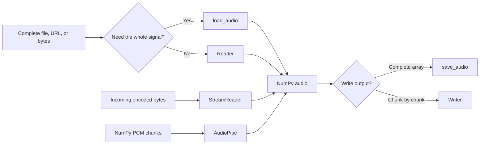
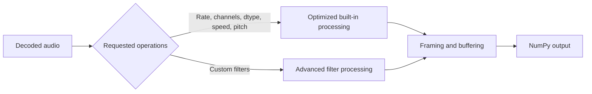

# audiolab

[](https://pypi.org/project/audiolab/)
[](https://github.com/pengzhendong/audiolab/actions/workflows/tests.yml)
[](https://github.com/pengzhendong/audiolab/blob/master/LICENSE)

`audiolab` is a compact Python toolkit for loading, transforming, streaming, inspecting, and saving audio. It accepts local files, URLs, encoded bytes, and file-like objects, and returns NumPy arrays with a consistent channels-first layout.

Common operations such as resampling, mono conversion, dtype conversion, speed changes, and pitch shifts use optimized processing paths automatically. You describe the result you want; `audiolab` chooses the implementation.

## Highlights

- Decode WAV, FLAC, MP3, AAC, M4A, WebM, and other formats supported by the installed audio libraries.
- Read from paths, URLs, `bytes`, and binary file-like objects.
- Resample, convert to mono, change dtype, alter speed, and shift pitch through one high-level API.
- Process complete files, decoded PCM chunks, or incoming encoded byte streams.
- Apply advanced audio filters when the high-level transforms are not enough.
- Write NumPy audio to files and file-like objects.
- Inspect audio metadata from Python or the `audi` command.

## Installation

```bash
pip install audiolab
```

Python 3.10 or newer is required.

## Quick start

### Load and transform audio

```python
import numpy as np

from audiolab import load_audio

audio, sample_rate = load_audio(
    "speech.mp3",
    offset=7.0,
    duration=23.0,
    sample_rate=16_000,
    to_mono=True,
    dtype=np.float32,
)

print(audio.shape)  # (channels, samples); here channels == 1
print(sample_rate)  # 16000
```

By default, decoded arrays are two-dimensional and channels-first: `(channels, samples)`. Set `always_2d=False` if you want mono audio returned as a one-dimensional array.

### Change speed and pitch

```python
from audiolab import load_audio

# 25% faster, with the original pitch preserved.
faster, sample_rate = load_audio("speech.wav", speed=1.25)

# Two semitones higher, with approximately the original duration preserved.
higher, sample_rate = load_audio("speech.wav", pitch_shift=2)

# Both operations can be combined.
transformed, sample_rate = load_audio("speech.wav", speed=0.9, pitch_shift=-3)
```

`speed` must be positive. Values above `1` shorten the audio; values below `1` lengthen it. `pitch_shift` is measured in semitones and does not change the reported sample rate.

### Save audio

```python
import numpy as np

from audiolab import save_audio

sample_rate = 44_100
time = np.arange(sample_rate * 5) / sample_rate
tone = np.sin(2 * np.pi * 440 * time).astype(np.float32)

save_audio("tone.wav", tone, sample_rate)
```

## Choose the right interface

| Input and goal | Use | Result |
| --- | --- | --- |
| Decode a complete source into memory | `load_audio` | One NumPy array and its sample rate |
| Iterate through a file or URL as decoded chunks | `Reader` | An iterator of `(audio, sample_rate)` |
| Decode encoded bytes as they arrive | `StreamReader` | Pulled decoded chunks |
| Transform NumPy PCM chunks | `AudioPipe` | Pulled transformed chunks |
| Save one complete NumPy array | `save_audio` | An audio file or file-like object |
| Write NumPy PCM chunks incrementally | `Writer` | A streamed audio output |
| Inspect metadata | `info` or `audi` | Codec, duration, rate, channels, and more |



## Processing model

The same high-level transform arguments work with `load_audio`, `Reader`, `StreamReader`, and `AudioPipe`:

| Argument | Meaning |
| --- | --- |
| `sample_rate` / `output_sample_rate` | Target sample rate in Hz |
| `to_mono` | Mix all input channels into one channel |
| `dtype` | Target NumPy dtype, such as `np.float32` or `np.int16` |
| `speed` | Playback-speed multiplier while preserving pitch |
| `pitch_shift` | Pitch change in semitones while preserving duration |

The public API does not require selecting a resampler or processing engine:



For advanced effects, pass an ordered `filters` list. Common transforms should stay in the high-level arguments so they can use the optimized path.

```python
from audiolab import load_audio
from audiolab.av.filter import highpass

audio, sample_rate = load_audio(
    "speech.wav",
    filters=[highpass(f=200)],
    sample_rate=16_000,
    to_mono=True,
)
```

See [Audio processing and filters](https://github.com/pengzhendong/audiolab/blob/master/docs/filters.md) for transform semantics, filter composition, and performance guidance.

## Streaming

Use `Reader` when the source is already available but the decoded signal should not be held entirely in memory:

```python
from audiolab import Reader, Writer

with Reader("input.flac", sample_rate=16_000, to_mono=True, frame_size=4096) as reader:
    with Writer("output.wav", reader.output_sample_rate) as writer:
        for audio, _ in reader:
            writer.write(audio)
```

Use `AudioPipe` when you already have NumPy chunks:

```python
from audiolab import AudioPipe

pipe = AudioPipe(input_sample_rate=48_000, output_sample_rate=16_000, to_mono=True)

for input_chunk in pcm_chunks:
    pipe.push(input_chunk)
    for output_chunk, output_rate in pipe.pull():
        consume(output_chunk, output_rate)

# Flush delayed samples and finalize the pipe exactly once.
for output_chunk, output_rate in pipe.pull(partial=True):
    consume(output_chunk, output_rate)
```

See the [streaming guide](https://github.com/pengzhendong/audiolab/blob/master/docs/streaming.md) for `Reader`, `StreamReader`, `AudioPipe`, finalization, buffering, and incremental writing.

## Inspect audio

From Python:

```python
from audiolab import info

metadata = info("audio.m4a")
print(metadata.sample_rate, metadata.num_channels, metadata.duration)
print(metadata)
metadata.close()
```

From the command line:

```bash
audi audio.m4a            # Show all available metadata
audi -r -c audio.wav      # Show sample rate and channel count
audi -d audio.wav         # Show human-readable duration
audi -D audio.wav         # Show duration in seconds
audi --help               # Show every option
```

## API at a glance

| API | Purpose |
| --- | --- |
| `load_audio(source, **options)` | Eagerly decode and transform a complete source |
| `Reader(source, **options)` | Incrementally decode and transform an available source |
| `StreamReader(**options)` | Incrementally decode pushed encoded bytes |
| `AudioPipe(input_sample_rate, **options)` | Transform pushed NumPy PCM chunks |
| `save_audio(destination, audio, sample_rate, ...)` | Save a complete NumPy array |
| `Writer(destination, sample_rate, ...)` | Write NumPy chunks incrementally |
| `info(source, ...)` | Read source metadata |
| `encode(audio, ...)` | Encode audio as a base64 data string or raw PCM base64 |

Low-level frame, format, and advanced filter helpers remain available under `audiolab.av` for specialized integrations; ordinary applications should prefer the high-level interfaces above.

Breaking changes and upgrade examples are tracked in the [changelog](https://github.com/pengzhendong/audiolab/blob/master/CHANGELOG.md) and [migration guide](https://github.com/pengzhendong/audiolab/blob/master/docs/migration.md).

## Development

```bash
python -m pip install -e ".[dev]"
python -m pytest -q --cov=audiolab --cov-fail-under=85
ruff check .
ruff format --check .
python benchmarks/processing.py
```

## License

[Apache License 2.0](https://github.com/pengzhendong/audiolab/blob/master/LICENSE)
