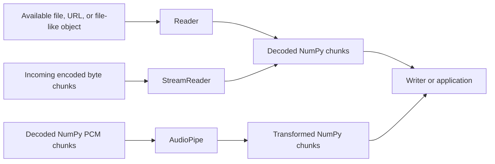
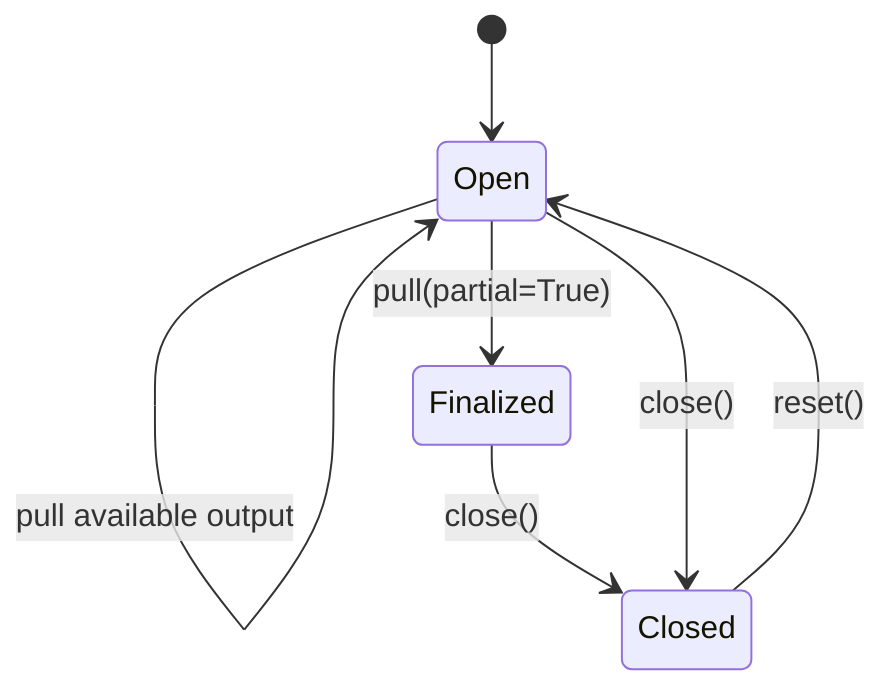

# Streaming audio

`audiolab` provides three streaming interfaces for three different input states:



| Interface | Push input | Pull or iterate output | Typical use |
| --- | --- | --- | --- |
| `Reader` | Nothing; source is passed to the constructor | Iterate the reader | Decode a known source without loading all PCM into memory |
| `StreamReader` | Encoded `bytes` | Call `pull()` | Decode data arriving from a network or producer |
| `AudioPipe` | NumPy PCM arrays | Call `pull()` | Transform already-decoded audio incrementally |

All output chunks are `(audio, sample_rate)` tuples. Audio arrays are channels-first.

## Reader: stream an available source

`Reader` opens a path, URL, encoded byte string, or binary file-like object and yields decoded chunks. Use it as a context manager so the source and decoder are released promptly.

```python
from audiolab import Reader

with Reader(
    "recording.flac",
    sample_rate=16_000,
    to_mono=True,
    frame_size=4096,
) as reader:
    for audio, sample_rate in reader:
        consume(audio, sample_rate)
```

`frame_size` sets the preferred number of samples per emitted chunk. The final chunk may be shorter. Set `fill_value=0` to pad it to a complete frame.

When output is written directly to a new file, pair `Reader` with `Writer`:

```python
from audiolab import Reader, Writer

with Reader("input.mp3", sample_rate=16_000, to_mono=True, frame_size=4096) as reader:
    with Writer("output.wav", reader.output_sample_rate) as writer:
        for audio, _ in reader:
            writer.write(audio)
```

## StreamReader: decode arriving encoded bytes

`StreamReader` is for encoded container data such as chunks of a WAV, MP3, or WebM file. The byte chunks are not PCM arrays.

```python
from audiolab import StreamReader

reader = StreamReader(sample_rate=16_000, to_mono=True, frame_size=1024)

with open("input.mp3", "rb") as source:
    while data := source.read(64 * 1024):
        reader.push(data)
        for audio, sample_rate in reader.pull():
            consume(audio, sample_rate)

# Signal end-of-input, wait for decoding, and flush delayed audio.
for audio, sample_rate in reader.pull(partial=True):
    consume(audio, sample_rate)

reader.close()
```

Push new bytes before calling `pull()`. Calling `pull()` without new input simply drains any already-produced output. `pull(partial=True)` means **end of input**: it finalizes the decoder and must be called only once for a stream.

Some containers require seeking to metadata near the end of the file. For those formats, output may not become available until finalization; `StreamReader` handles the temporary seekable storage internally.

Use `buffered_bytes` to observe unread encoded input. Call `reset()` only when you want to discard the current state and decode a new independent stream with the same configuration.

## AudioPipe: transform PCM chunks

`AudioPipe` accepts NumPy audio that has already been decoded. Pushed arrays are treated as consecutive chunks at the configured input sample rate, and their channel count must remain consistent.

```python
from audiolab import AudioPipe

pipe = AudioPipe(
    input_sample_rate=48_000,
    output_sample_rate=16_000,
    to_mono=True,
    speed=1.1,
    pitch_shift=2,
    frame_size=1024,
)

for input_chunk in pcm_chunks:
    pipe.push(input_chunk)
    for audio, sample_rate in pipe.pull():
        consume(audio, sample_rate)

for audio, sample_rate in pipe.pull(partial=True):
    consume(audio, sample_rate)

pipe.close()
```

`AudioPipe` has a bounded buffering limit by default. If `push()` raises `BufferError`, pull the available output before pushing more data. `buffered_bytes` includes unpulled input accounting and Python-owned PCM retained while waiting for a complete frame; small native DSP delay buffers are not included. Configure the limit with `max_buffered_bytes`.

## Finalization and ownership

The streaming lifecycle is deliberately explicit:



- `pull()` drains output that is currently available.
- `pull(partial=True)` declares that no more input will arrive and flushes delayed samples.
- `close()` releases buffers, decoders, and processing state. It does not flush output for you.
- `reset()` discards the current stream and prepares the same object for unrelated new input.

Prefer context managers for `Reader` and `Writer`. For `StreamReader` and `AudioPipe`, use `try`/`finally` when an exception could interrupt the producer:

```python
pipe = AudioPipe(input_sample_rate=48_000)
try:
    process_with(pipe)
finally:
    pipe.close()
```

## Chunk-size guidance

Larger chunks reduce Python call overhead but increase latency and temporary memory use. A practical starting point is:

- 1024 to 4096 samples for interactive or low-latency PCM processing.
- 4096 to 65536 samples for offline throughput-oriented processing.
- 32 KiB to 256 KiB for encoded byte chunks, depending on the source and transport.

These are starting points rather than correctness requirements. Measure with representative audio and the latency constraints of your application.

[Back to README](../README.md) · [Audio processing and filters](filters.md)
